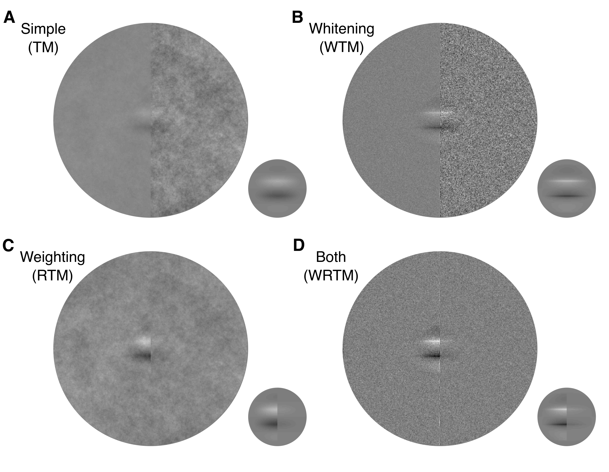

# Detection of Targets in Filtered Noise: Whitening in Space and Spatial Frequency

## Table of Contents

1. background: functions to create specific types of noise backgrounds.
2. experiment: experiment data of detecting 1.5-cpd and 3-cpd targets in 1/f noise.
3. figure_data: results of analysis used to plot figures in our corresponding paper (in submission).
4. filter_operation: filter operation used in the template matching models.
5. matching: template matching models juggling whitening in space, whitening in spatial frequency, eye filtering and positional uncertainty.
6. mathematics: mathematical functions used in the project. Special thanks to Abhranil Das for [the Matlab package](https://www.mathworks.com/matlabcentral/fileexchange/84973-integrate-and-classify-normal-distributions) to integrate and classify normal distributions.
7. simulation: simulation results of two experiments mentioned above and the exploration of model performance in [natural images](https://natural-scenes.cps.utexas.edu/).

## Function / Purpose

This repository is a summary of my research project under the supervision of Wilson Geisler. It provides optimal and sub-optimal model observers for detecting deterministic targets in wide sense stationary 2D noise. These models are also very efficient in non-stationary noises, such as the natural images.

## Contact

Email: anqizhang@utexas.edu

LinkedIn: www.linkedin.com/in/anqi-work
